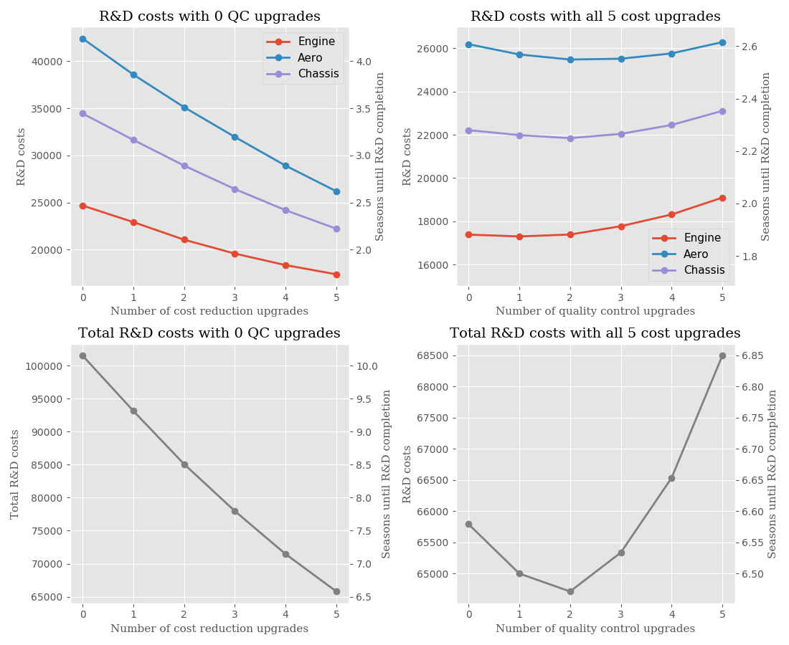

# Simulation of Research and Development in F1 2017

Scripts for conducting statistical simulations of the R&D process in F1 2017. The aim is
to gain insights into the optimal way to spend resource points in order to develop
the car in the fastes possible way. The results from running the script is output data in a
text a file and some plots showing how the R&D costs behave as functions of the cost reduction
and quality control extra upgrades. In the case where cost reduction or quality control upgrades
are bought, they are assumed to be purchased at the very start of the R&D process (because this
would be cheaper than buying them later in the process if you're going to buy them anyway).

The only uncertain parameters in the simulation, the parameter p_fail (describing the probability
that an upgrade will fail on its first attempt before any quality control extra upgrades are applied)
and the rate at which the fail probability decreases once it has already failed. Based on the quality
control upgrades reducing failure probability by 0.075, it seems like p_fail must at leastbe 0.375 and
is most likely not larger than 0.5. Below are the results for a range of p_fails between these values
plottet. Also assumed in the model is that the probability for an upgrade to fail once it has already
failed gets reduced by 50%. This occurs if the upgrade would fail a second time as well. Currently
upgrades are set to succeed on the third attempt, i.e. the fail probability is zer on the third attempt
at an upgrade.

Feel free to play around with the parameters and see how they affect the results. Below is an example
of the results of the simulation.

