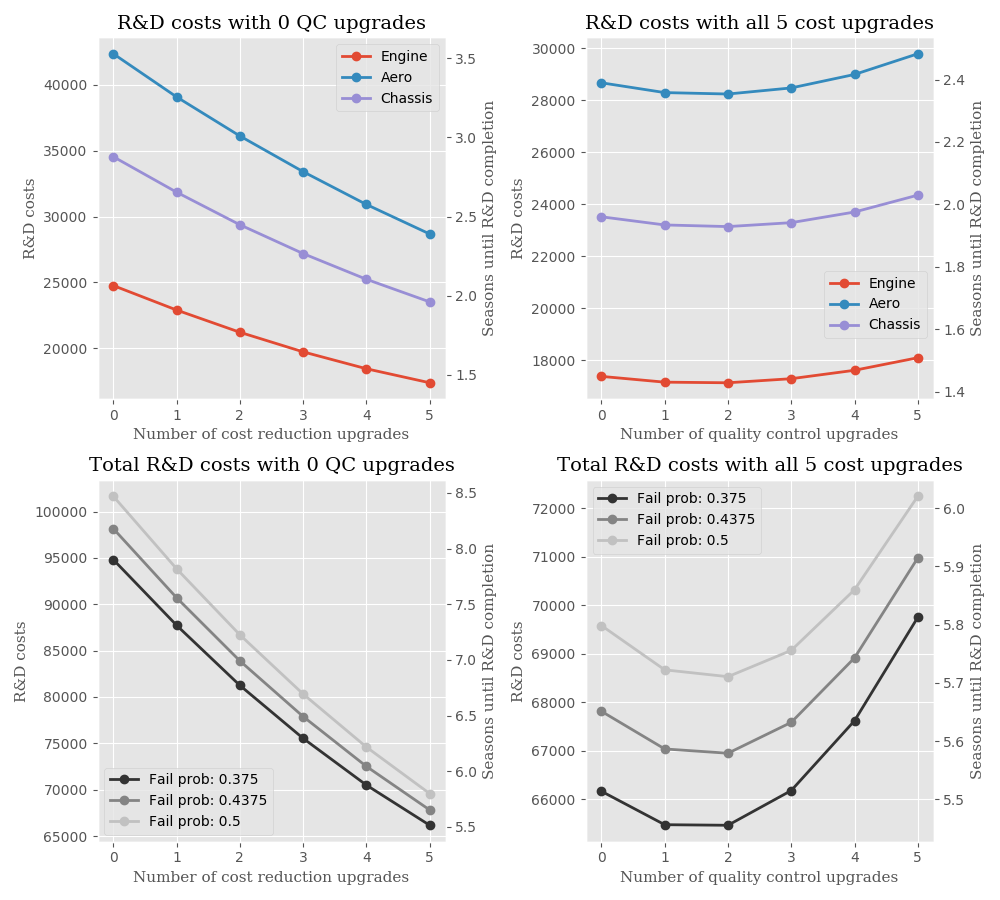

# Simulation of Research and Development in F1 2017

Code for doing statistical simulations of the R&D process in F1 2017. The aim is to gain insights into the optimal way to spend resource points in order to develop the car in the fastes possible way. Data for number of upgrades per department and upgrade costs, are gathered from in-game F1 2017. The results from running the script is output data in a text a file and some plots showing how the R&D costs behave as functions of the cost reduction and quality control extra upgrades. In the case where cost reduction or quality control upgrades are bought, they are assumed to be purchased at the very start of the R&D process (because this would be cheaper than buying them later in the process if you're going to buy them anyway).

## Results

The top two plots visualizes the R&D costs for each performance department (not counting the durability upgrades for engine and gearbox) as a function of cost reduction upgrades and quality control upgrades, respectively. The two lower plots show the sum of all three departments and for different choices of the slightly uncertain parameter `p_fail`. (The top two plots use probability `p_fail`= 50% that an upgrade will fail on first attempt (see uncertainty discussion below for further info on this)). The left y-axis in each plot shows amount of resource points required while the right y-axis show the number of seasons required assuming 600 resource points earned per race weekend.

### Some key features to notice about the results:

* There are significant differences in R&D costs depending on department regardless of cost reduction and quality control upgrades. Aero being the most expensive (it has most upgrades and most expensive cost reduction upgrades), engine the cheapest department and chassis somwehere in between.

* Running the simulation many times made it clear that, regardless of number of quality control upgrades applied, it's always beneficial to buy all 5 cost reduction upgrades at the start of development. It gives a slow start to development, but as can be seen in the two left plots of the figure, gives great financial benefit in the long run. This can also be seen in the [text file](results.txt).

* Keeping the above point in mind, we move on to look at the optimal number of quality control (QC) upgrades. Look at the two right plots in the figure. Here it can be seen that the optimal solution for each department (although slightly different) are 2 QC upgrades (1 also being a good option). This provides the best balance between spedning resource points on the QC upgrades and avoiding having to respend on upgrades due to failed upgrades.

* The effect of the parameter `p_fail` (discussed below) can be seen in the two lower plots. And as one might expect, a lower value results in lower overall R&D costs since the probability that each upgrade will fail is less. Also in the lower right plot we can also see, through the rightwards shift that the importance of quality upgrades increases as the failure probability increases. This seems resonable.

* Regarding numbers we see that using the most cost effective development path, you will need around 65K-70K resource points or 5.5-5.8 seasons (assuming 600 resource points per race weekend (this might be a bit high assumption) in order tu fully develop the performance departments engine, aero and chassis. When counting the durability upgrades as well, you need an additional 11.5K resource points, or 1 more season. This would bring total for 100% upgraded car to 76.5K-81.5K resource points or 6.5-6.8 seasons. See more detailed numbers in the [text file](results.txt).

**Final conclusion: Optimal strategy for lowest possible R&D costs for a fully developed car, is 5 cost reduction upgrades and 2 quality control upgrades.**

## Uncertain parameters
There are only two somewhat uncertain parameters in the simulation:
* `p_fail`: The probability that an upgrade will fail on its first attempt before any quality control extra upgrades are applied.Based on the quality control upgrades reducing failure probability by 0.075, it seems like p_fail must at leastbe 0.375 and is most likely not larger than 0.5. Above are the results for a range of `p_fail`'s between these values plottet and, as can be seen, the different choices of `p_fail` does not significantly affect the results and the main conclusions discussed above remain the same.

* Assumed in the model is that the probability for an upgrade to fail, once it has already
failed, gets reduced by 50%. This occurs if the upgrade would fail a second time as well. Currently
upgrades are set to succeed on the third attempt, i.e. the fail probability is zero on the third attempt
at an upgrade.
